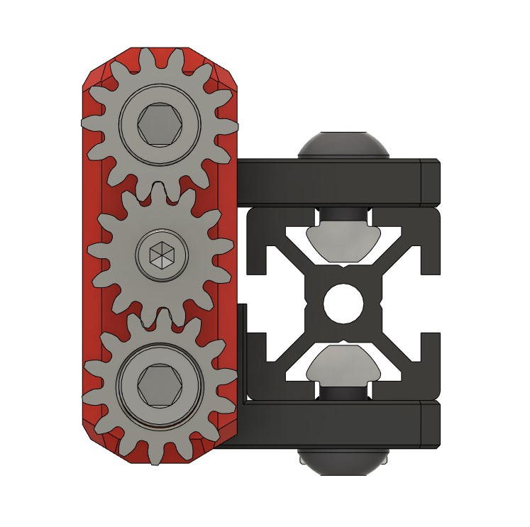

# Trident Beefy Idler Gears
 ### 

### BOM

Size | Qty
--- | ---
M3x8 BHCS    | 1

### Printing
  * Default voron settings
  * No supports needed

### Instructions:

  * Glue two larger gears to the heads of your M5x40 BHCS using superglue
  * Install BFI as you normally would and adjust top and bottom M5x40 BHCS so that belt runs centered 
  * Once centered install the smaller idler gear using an M3x8 BHCS screw (do not overtighten)
  * Gears should be a snug fit to eliminate backlash. Scale the center idler gear if needed to acheive a good fit. 
    
