# GT2 Belt Tension Meter (RC2)

 
  
  

### DETAILS:
This 3D printed tension meter is designed to measure belt deflection to determine belt tension for Gates 6 and 9mm GT2 belts. The goal is to eliminate the need for phone apps that use frequency to determine tension and to provide an easily quantifiable and repeatable number to use when tensioning belts on a 3D printer. The repeatability and accuracy of this meter will be partially dependent on the build quality but you can expect  approximately ± 1.0N (0.25lb) accuracy on a carefully built and calibrated meter. 

Tested on the following printers: Voron Trident, 2.4, V.0, Salad Fork, and Switchwire.  Note: for other non listed printers please ensure you have clear access to at least 150mm of belt. This meter will not work on printers with belts that run inside of the extrusion channels. 

[!CAUTION] The instructions and tension lookup tables contained herein are to be used with the the RC2 STL files included in this repository only. Any modifications, remixes, or substitutions of the core components have the potential to change the meter's characteristics and accuracy. Many iterations and months of testing were done with the current design (RC2) prior to its release to ensure an accurate and repeatable device. 

Complete Assembled and Calibrated Meters Available Here:  And Here:  

### Ready to build your own? 

### BOM:
Item | Qty
--- | ---
M3x7 Button Head Cap Screw (M3x6 BHCS also works) | 1
M3x25 Socket Head Cap Screw | 1
M3x8x0.6 Washer | 1
M2x10 Socket Head  Self Tapping Screws | 2
[0.81mm x 100mm (0.032” x 4”) Tempered steel music wire AKA "piano wire"](https://www.amazon.com/dp/B002WXGIHC?psc=1&ref=ppx_yo2ov_dt_b_product_details) | 1
[6mm OD x 0.6mm wire dia. x 50mm free length compression spring with 20 active coils (0.35N/mm spring rate)](https://www.amazon.com/dp/B076LTYY5K?psc=1&ref=ppx_yo2ov_dt_b_product_details) | 1
Complete Set of Printed [Parts](https://github.com/Diyshift/3D-Printer/tree/main/GT2%20Belt%20Tension%20Meter/STLs) | 1

Hardware Kits available from the following:  &nbsp;&nbsp;&nbsp;&nbsp;  &nbsp;&nbsp;&nbsp;&nbsp; 

### TOOLS:
 * M3 drill bit and holder 
 * ABS safe grease such as SuperLube Synthetic or Oatey/Harvey's silicone grease
 * 1.5, 2, and 2.5mm hex bit drivers. Ball end hex keys will likely give you a hard time here.
 * Toothpicks and Q-tips for applying grease
 * Hobby knife (X-Acto) 
 * Small flat needle file (optional)
 * Small triangular smooth cut file (for cleaning up gear teeth and tuning dovetail)
 * Cutter capable of cutting hardened music wire (do NOT use your nice flush cutters for this)

### PRINT SETTINGS:
 * Print in ABS or ASA for best results
 * Slide, needle and spring spacer components work best when printed on smooth or satin PEI
 * Layer height 0.2mm
 * 4 perimeters 5 top and 5 bottom layers
 * 40% grid infill
 * Single perimeter tops will improve the dialface text considerably
 * 0.4mm nozzle with 0.4mm line width throughout 
 * No seams allowed on needle or slide gear teeth, use blockers or adjust seam settings in your slicer. 
 * Color change at layer 18 for Base and layer 43 Pivot for dual color contrasting text.
 * Your printer should be well tuned for this project (for example, able to produce a near-perfect Voron cube). Any PA issues or over/under extrusion will likely result in a poorly performing meter.
   
### ASSEMBLY:

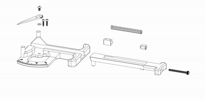

1. Clean up printed parts as needed. Correct any zits, blobs or other print defects using a small file or hobby knife. Pay special attention to the gear teeth on the slide and needle. Carefully remove any stringing or blobs taking care not to change the tooth profile.
2. Check the fit between the slide and base. It should be loose enough to drop into the base freely without using force. The slide is designed to "float" in the base when in use. See gif below for proper fit. 
   
   

   If your slide it too tight you can adjust the fit in the base by shaving the dovetail in tiny increments with a triangular file on the angled face opposite the dial. 
4. Using a cotton swab, apply a light layer of grease to the spring channel  in the shaded area shown below. Do not lubricate the meter Base or Slide dovetail area as stiction may occur causing inaccurate readings.
5. Insert the spring, spacer, and spring as shown below.

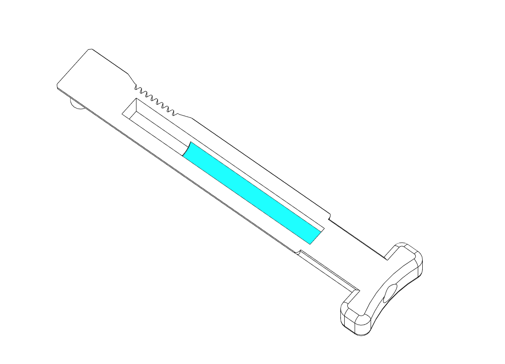

5. Insert the spring spacer, spring and spring block in that order as shown. Note of the position of the counterbores on the spring block, they should be facing down in this step.

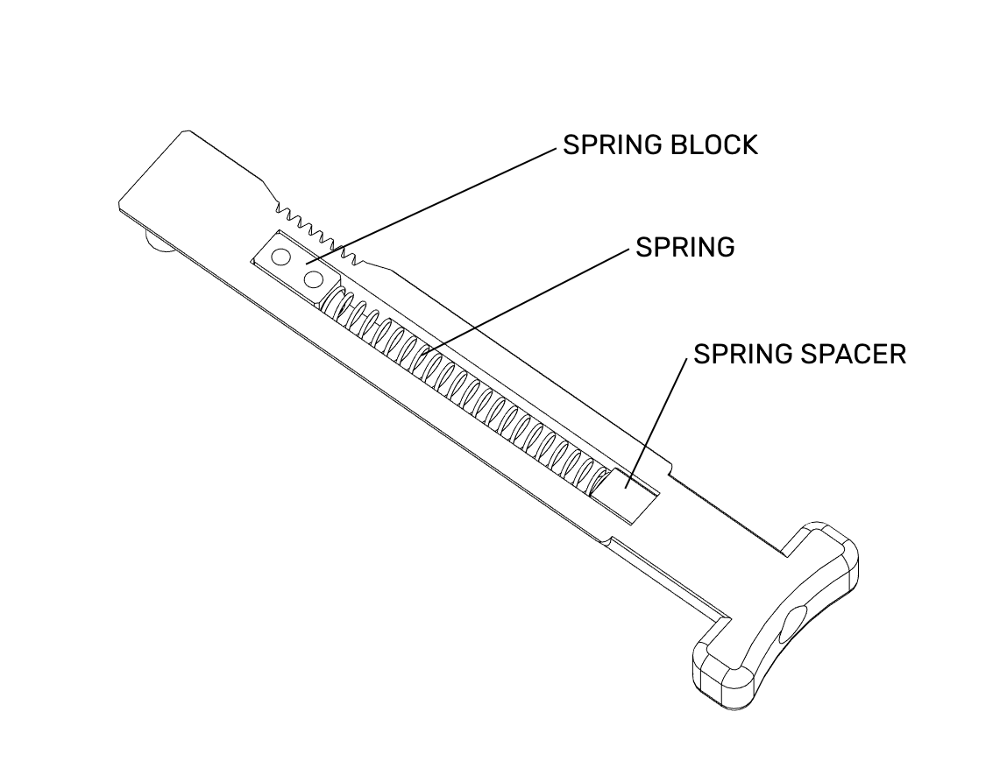

 6. Flip the assembled slide and carefully insert the slide into the base as shown below. Spring tension should hold the parts in place.

 7. Align the slide with the front of the base so that they are flush and the two holes in the spring block are aligned with the corresponding holes in the base and secure the spring block to the base using two self-tapping M2 screws.

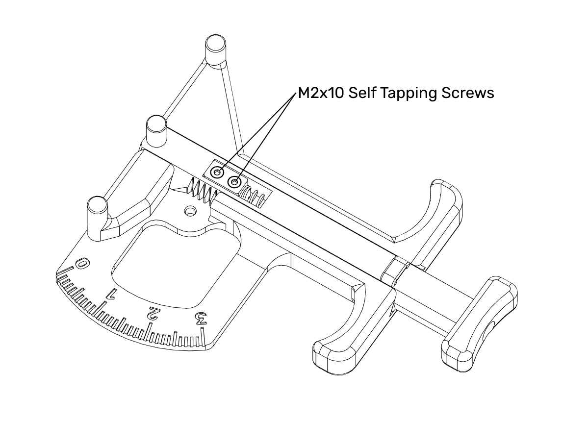

8. Depress slide plunger to check that the slide is moving smoothly and without binding.
9. Starting with a #2 needle use trial and error to determine the needle with the best fit. When aligned on the hole, the needle’s teeth will mesh with the slide’s teeth.

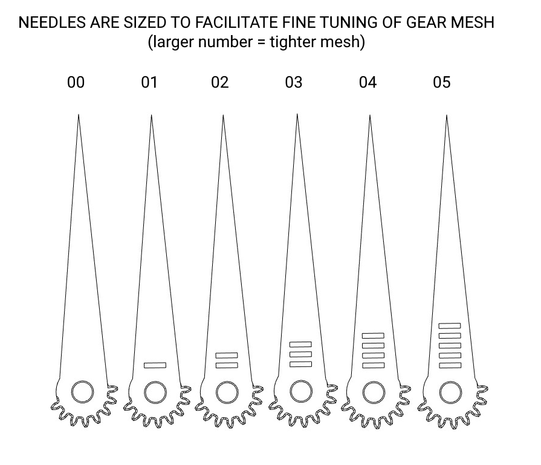

10. Ream the hole in the needle with a 3mm drill bit and check the fit using the M3x25 SHCS screw. The needle should rotate freely under its own weight. (tip: if you don’t own a 3mm drill bit you can use the M3x25 screw to ream the hole by screwing it into the needle and intentionally stripping the threads)
11. Insert the M3x6 BHCS through the top of the needle (as denoted by the circular stamp).
12. Place the M3x8 washer onto the base, aligning it with the hole with the smoothest side up. (some washers have a burr from stamping, this should face down for best result)
13. Secure the needle onto the washer with the M3x7 BHCS, making sure the needle aligns to the zero position and the round divot is facing up. 

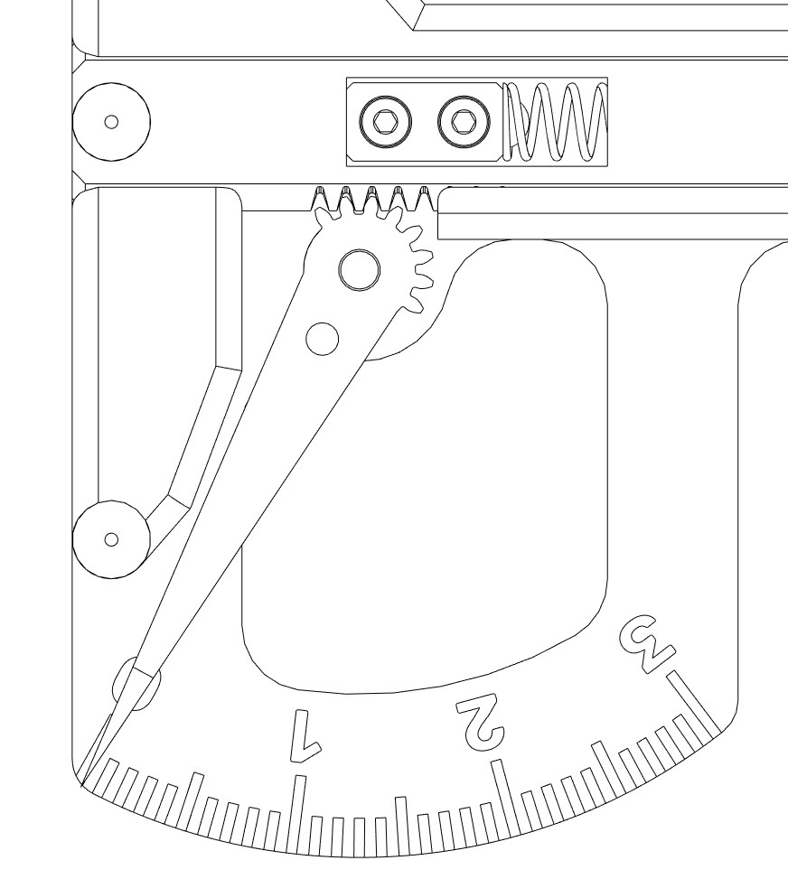 

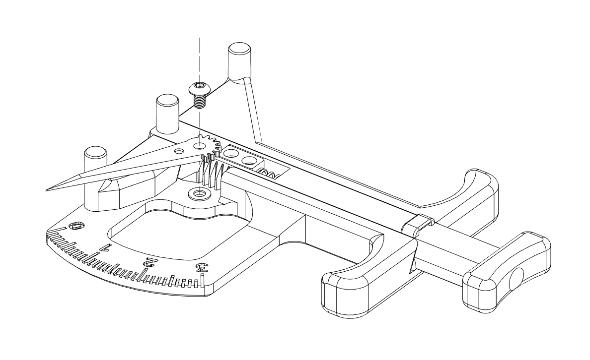

14. Tighten screw until just snug then back off in small increments until the needle moves freely.
15. Depress the slide’s plunger several times to ensure that the needle moves freely without jumping or binding.
16. Check the needle’s backlash by gently wiggling with a finger. If the needle moves more than ½ a tick on the dial, swap to the next size up and repeat this test. You want a needle size that gives you the least amount of backlash while still allowing smooth motion of the slide.
17. Once you have the correct needle selected, use a toothpick or similar to apply a very small amount of grease to the areas shown below.
18. Test to confirm that the needle spins freely on the screw.

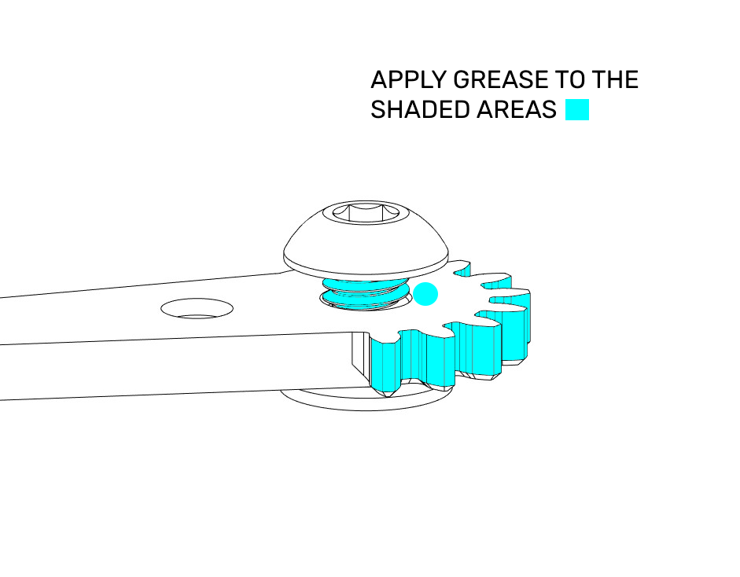

19. Flip the needle over and apply a very light layer of grease to the area that contacts the M3x8 washer, being careful not to get any on the lower threads.

20. Apply a small amount of grease to the teeth on the needle as shown.
21. Place the M3x8 washer back onto the base.
22. Again, tighten the screw until just snug then back off until the needle swings freely.
23. Cycle the slide 20-30 times to make sure grease is distributed and the gears mesh.
24. Slowly cycle the slide several times and observe the needle’s motion. It should be smooth throughout its entire range with no sticking or jumping.  Adjust screw securing needle as needed to facilitate free movement.
25. Finally, install the M3x25 SHCS Preload Screw into the slide plunger as shown. This screw is threaded into plastic. Tighten until the head is flush with the plunger. Your meter is now assembled and ready for calibration.

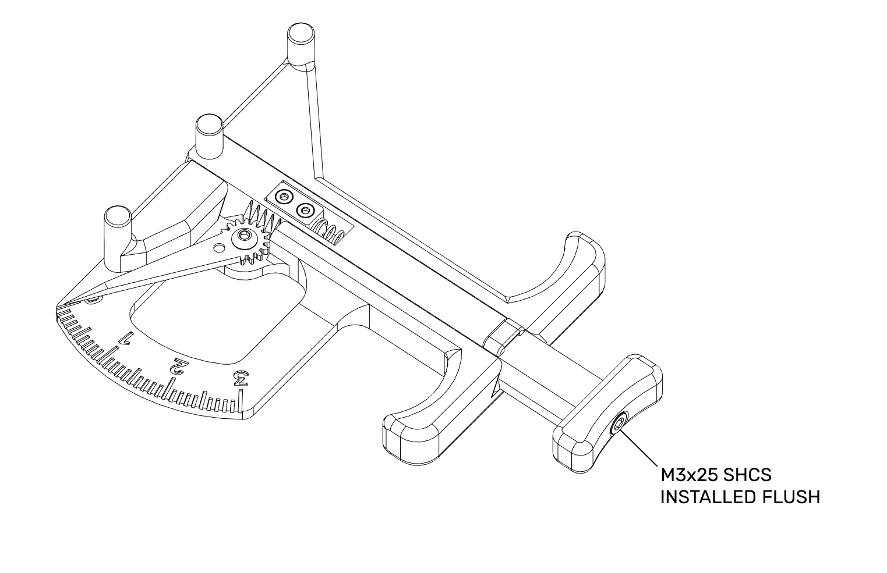

**Note:** If your meter dial is not resting on the zero mark you may need to loosen the two self tapping screws slightly in the spring block move needle to zero position then tighten screws back down. 

### CALIBRATION:

1. Cut music wire to 100mm and deburr the ends with a file.  (note: do not use your good side cutters for music wire, dremel cutoff or hard wire cutter recommended).
2. Glue the wire into the hole on the side of the calibration handle making sure it is fully seated and flush on the opposite side. Afterwards remove any burrs or glue from the hole in the calibration pivot. It should rotate freely on the left pin when installed.

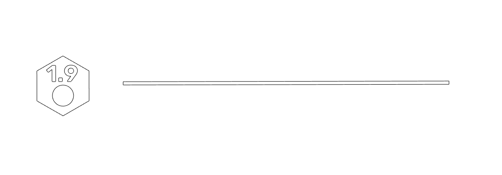

3. Depress plunger and place calibration wire into the jaws making sure the pivot is seated all the way on the left pin as shown. Eye protection is recommended for this step.

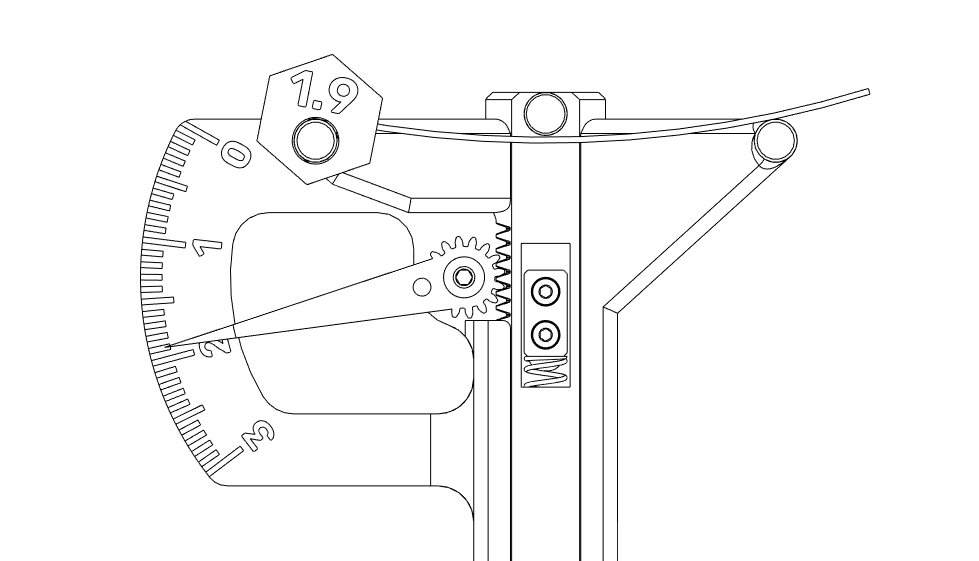

4. Slowly release the plunger and note the reading on the dial. Lightly tapping or “pumping” the plunger handle can help to settle the needle and get a better reading.
5. Tighten the preload screw one turn then depress and release the plunger again. Note that the reading has changed.
6. Repeat steps 3 - 5 until your meter consistently reads 1.9 when checking the deflection of the music wire.
7. Your meter is now calibrated and ready for use.

 ### ALTERNATIVE CALIBRATION:  
If straight tempered music wire is not available a suitable weight and spare section of belt can be used. A gallon plastic water jug and scale works well for this. Do not trust weights marked on fitness equipment, weigh them first. 

1. Suspend a 1.36Kg (3lb) weight vertically from a 250mm section of GT2 belt and measure the tension with the belt teeth in contact with the two outer pins on the meter as shown below in step 3.
2. Adjust the preload screw as needed until the meter reads consistently across several measurements.  2.1 for standard rubber or 2.2 EPDM high temperature belt.

   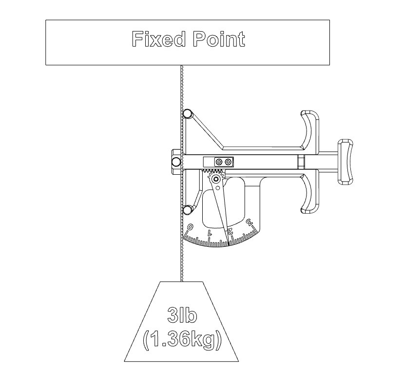

Calibration wire can be stowed on the center pin with wire secured beneath the slides wire keeper. 

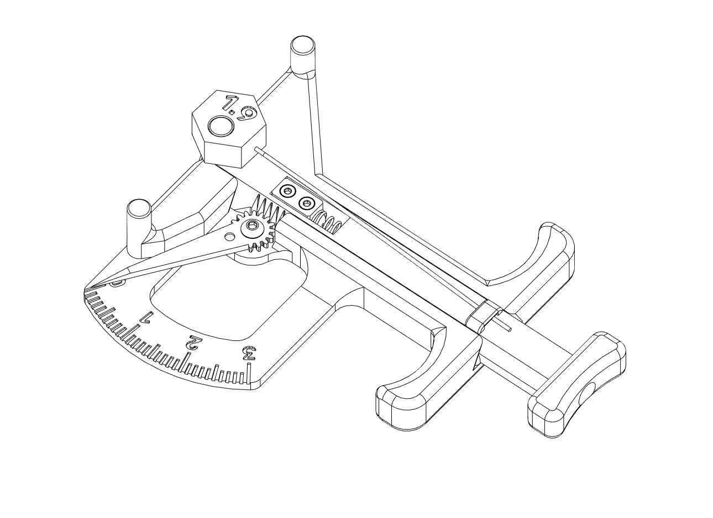

 ### TENSION MEASUREMENT A/B BELTS: 

 1. Printer should be cold for this test.
 2. Refer to your printer's documentation for proper belt tension or see table below.
 3. Center toolhead on X and then move Y until the X/Y idler centers are 150mm from the front idler centers. Motors should be on for this test. (note: unlike phone apps the 150mm distance is not a critical distance just a way to ensure that the toolhead is centered and to aid in obtaining repeatable results).
 4. Depress plunger and place meter on the 150mm belt span so that belt is routed through the gauge pins as shown.

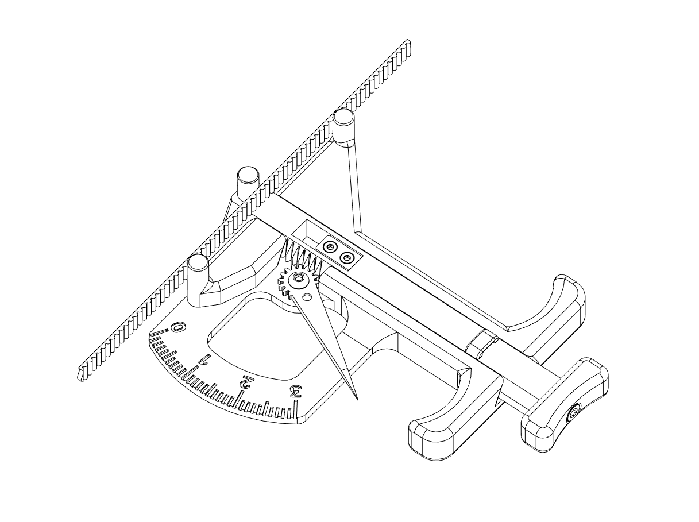

 5. Slowly release the plunger and note the reading on the dial. *rocking the meter very slightly fore and aft or lightly “pumping” plunger can help to settle the needle and get an accurate reading.
 6. Repeat three times to ensure you are getting consistent readings.
 7. Adjust belt tension then repeat steps 3-5 until you reach the desired tension (see table below) The A/B belt tensions can affect each other. Tightening one will also tighten the other. Go back and forth adjusting each until they are equal.

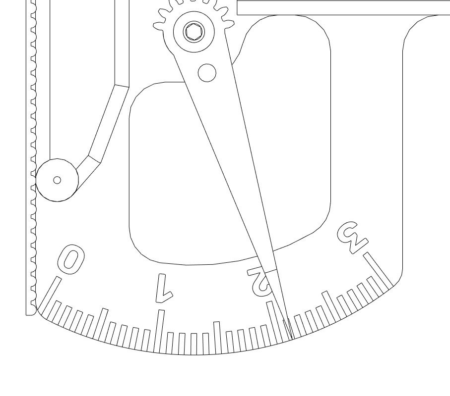

8. Home X and Y to seat the belts then repeat steps 2-5 to verify that tension is correct and make followup adjustments as needed.
9. Your belts should now be properly tensioned. 

Note:  Depending on your style of printer your belt tension may increase slightly when utilizing a heated chamber so keep this in mind when selecting tensions in the higher range. Check your belts after a preheat to be sure you are not exceeding safe limits. When checking tension always remember to run the measured axis through its full range of travel before measuring to normalize the tension in the belt path. 

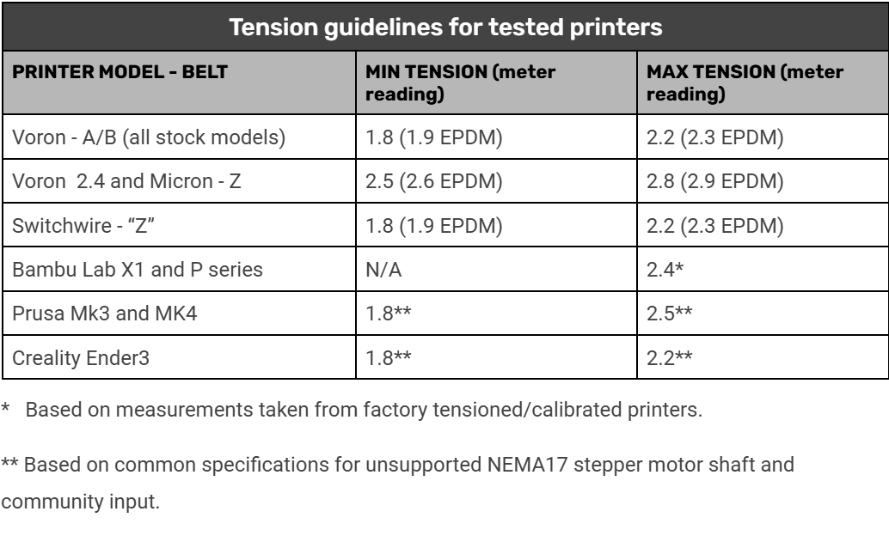
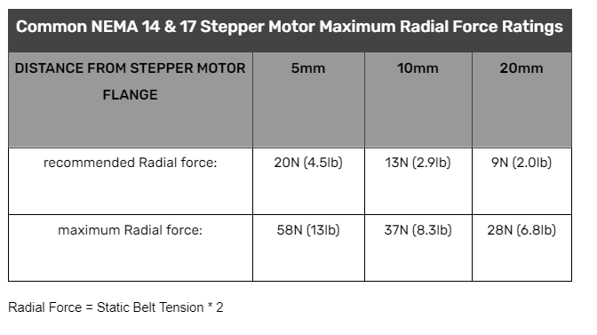
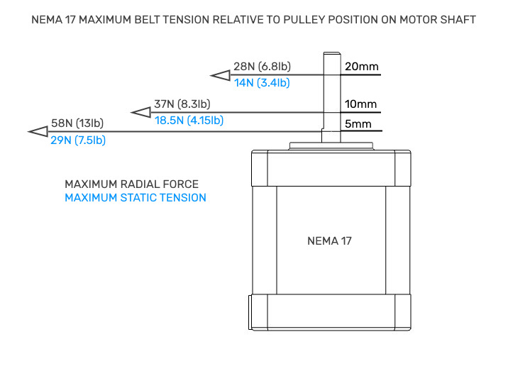
  
### CREDITS
Sincere thanks to the following for donating their time, plastic, and patience in helping to test and provide feedback on this design: 
 * Le0n2959
 * Moogoo (oogoom)
 * Yeri (yeriwyn)
 * Dokuu
 * Xivima
 * Mc-Red
 * Lillianamirrors
 * Pnewb
   

 My projects are 100% fueled by coffee. If you enjoy the work I do and would like to buy me one, you can do so here. Thank you for your support! 

This work is licensed under a
[Creative Commons Attribution-NonCommercial-ShareAlike 4.0 International License][cc-by-nc-sa].

[![CC BY-NC-SA 4.0][cc-by-nc-sa-image]][cc-by-nc-sa]

[cc-by-nc-sa]: http://creativecommons.org/licenses/by-nc-sa/4.0/
[cc-by-nc-sa-image]: https://licensebuttons.net/l/by-nc-sa/4.0/88x31.png
[cc-by-nc-sa-shield]: https://img.shields.io/badge/License-CC%20BY--NC--SA%204.0-lightgrey.svg
