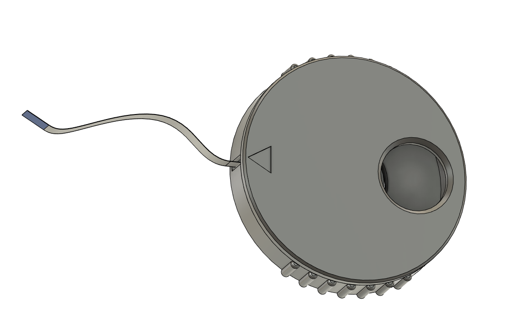

# LDO ADXL Ribbon Winder
Stores FFC ribbon cable for LDO Input Shaper Toolkit. 

Snap halves together then line up the slot with the arrow on the lid. Insert the end of the ribbon cable and push until it stops. Use the large hole in the lid to wind up with your finger until just the blue tab is showing. Pull the ribbon when you need to remove it. 

You can view it in action here: https://youtube.com/shorts/ohC4sa6RvPU?feature=share

