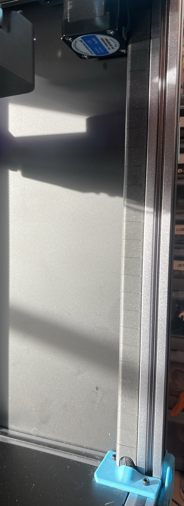

# Misumi Clip Cable Channels
 ### A collection of clips to 2020 extrusion to form channels to run/hide your wires 

### Printing
  * Default voron settings
  * No supports needed

### Instructions:
 
Snap into extrusionslots to form wire channels. Cutouts models are provided for wire entry/exit. Shown here on vertical extrusions for Trident:

