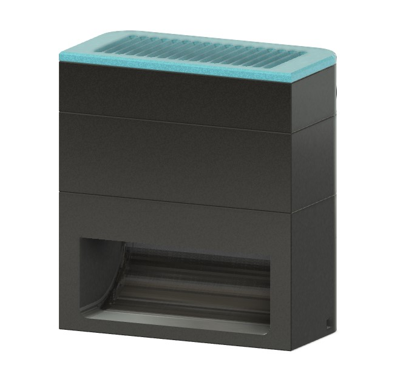
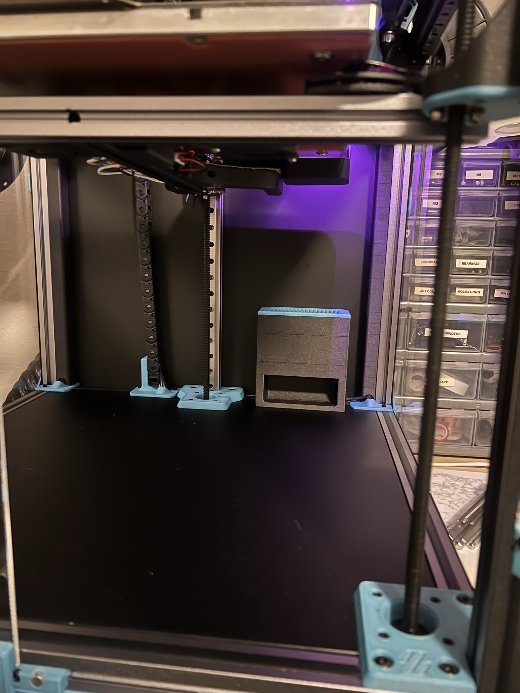

# Short Stack Bento Box Carbon/HEPA Filter
 ### A shortened remixed version of the wonderful original design found here: https://www.printables.com/model/272525-bambu-lab-x1c-bentobox-air-filter

### BOM

Size | Qty
--- | ---
40x10 Axial Fan | 2
M3x8 Socket Head Cap Screws | 10
M3 Heat Set Inserts | 12
M3 Hammer Nuts | 2
40x80x15mm Hepa Filter | 1
6x3mm N52 Disc Magnets | 32
Acid-Free Activated Carbon

### Printing
  * Default voron settings
  * No supports needed

### Instructions:
For Trident mount duct to 2020 rear extrusion using the two rearmost through holes, M3x8 screws and hammer nuts. Then secure fan mount and stack the remaining modules. 

This version for use with this size HEPA filter only: https://www.amazon.com/gp/product/B0782T7L6P/ref=ppx_yo_dt_b_search_asin_title?ie=UTF8&psc=1
