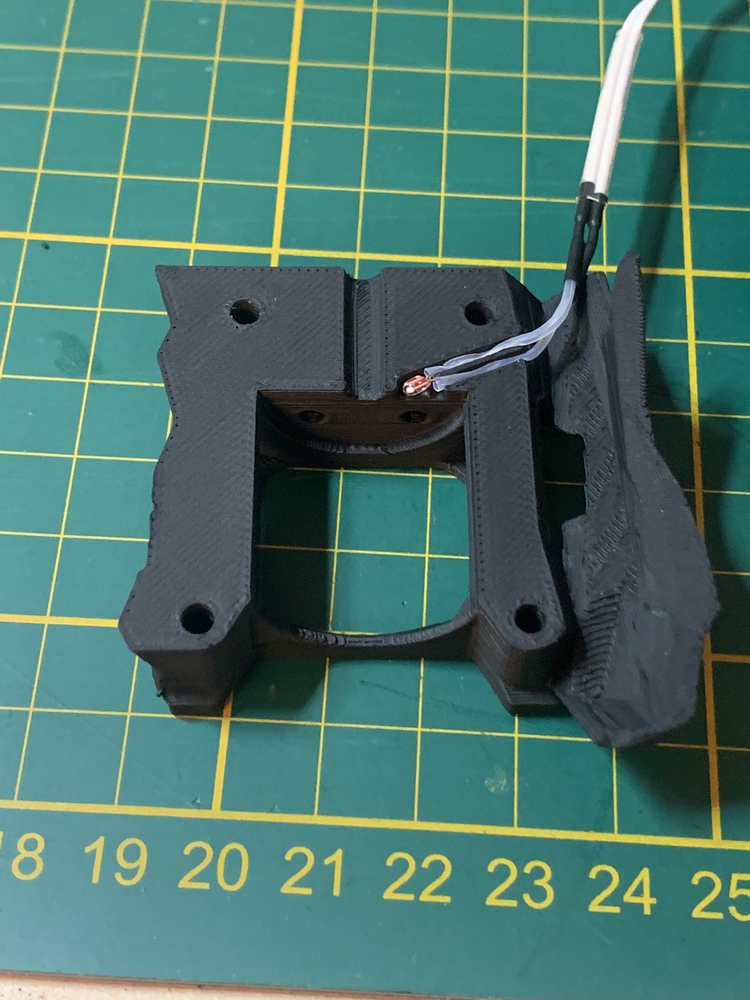

# Stealthburner Heatsink Thermistor Mod for Dragon Hotends
 ### Allows you to monitor the temperature of your heatsink where it mounts to the toolhead. Klipped can be configured to shutdown if this gets too hot in the event of a hotend fan failure.   

### BOM
100K Ohm NTC 3950

### Printing
  * Default voron settings
  * No supports needed

### Instructions:
 Add a small dab of thermal grease to the thermistor before assembly. 
 
printer.cfg example: 

[temperature_sensor heatsink_temp]

sensor_type: Generic 3950

sensor_pin:      #port that sthermistor is plugged into

min_temp: 0

max_temp: 90     #halt printer if ABS deflection temp is exceeded

