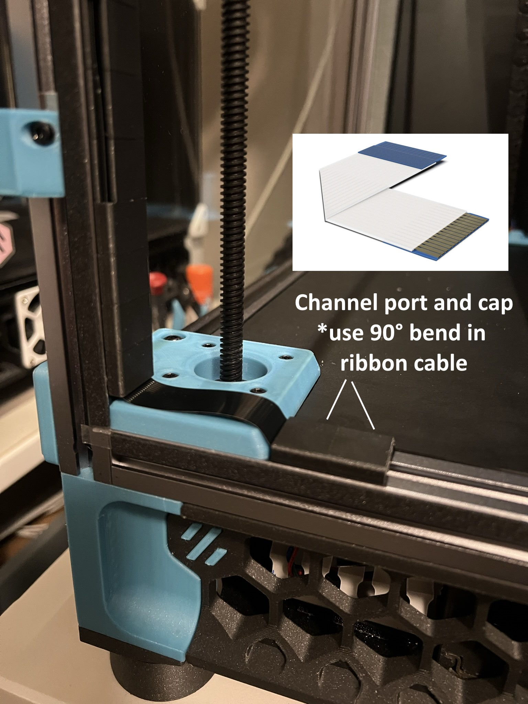

# Trident Corner Pi Cam 
 ### 

### BOM

Size | Qty
--- | ---
Arducam Arducam Lens Board OV5647    | 1
150° M12 Wide Angle Lens             | 1
1 Meter FFC Pi cam Cable             | 1
M3x5 BHCS                            | 3
M3x8 SHCS                            | 2
M3 Hammer Nuts                       | 1
M3 Heat Set Insert                   | 1
M2x6 Socket Head Self-Tapping Screws | 4

### Printing
  * Default voron settings
  * No supports needed

### Instructions:
 

