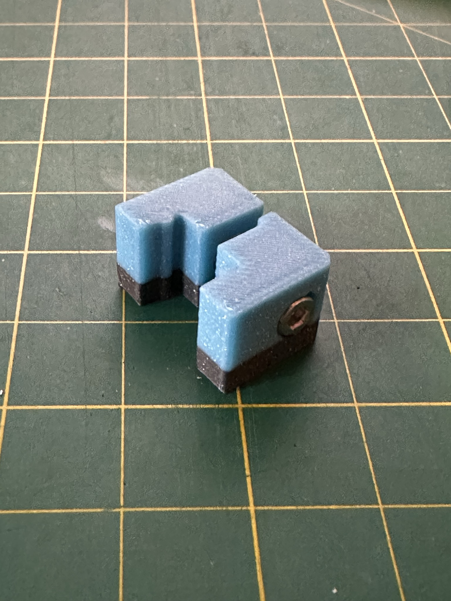
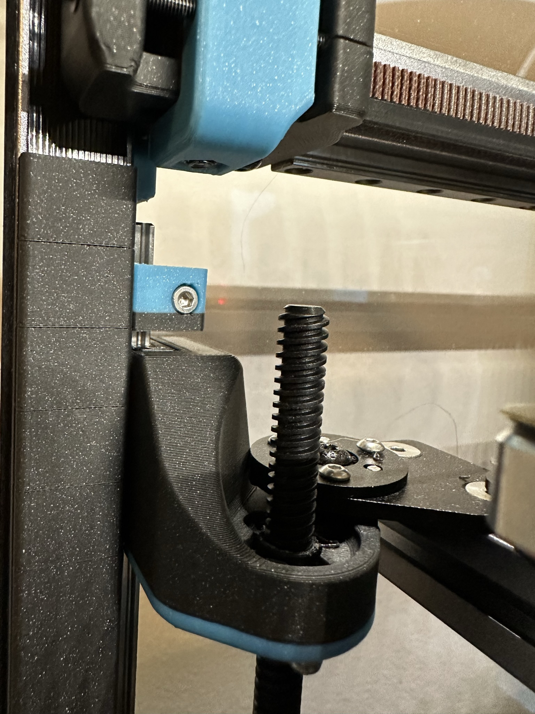

# Trident MGN9 Z Crash Pads

 ### Limit Z travel to minimize damage to X gantry and components in the event of a homing crash

### BOM

Size | Qty
--- | ---
Printed Crash Pad A.stl        | 3
Printed Crash Pad B.stl        | 3
M3x16 Socket Head Cap Screws   | 3
M3x4 Heat Set Inserts          | 3

### Printing
  * Default voron settings
  * No supports needed

### Instructions:

  * Install the tickest print bed/surface you plan to use. 
  * Home printer, Z-tilt
  * calibrate_z (only if using auto Z offset)
  * Center toolhead over bed and move to Z0 
  * Wipe any grease off of linear Z rail above the Z carriage and attach the crash pad as shown
  * Place 2-3mm hex key between the crash pad and the Z carriage to set the height
  * Tighten firmly and check to make sure it does not move
  * Now if z homing fails for any reason your z travel will be limited to Z-3. While this won't save your PEI it will stall the motors and prevent twisting your X extrusion and or breaking your X carriage components. 
  
   

