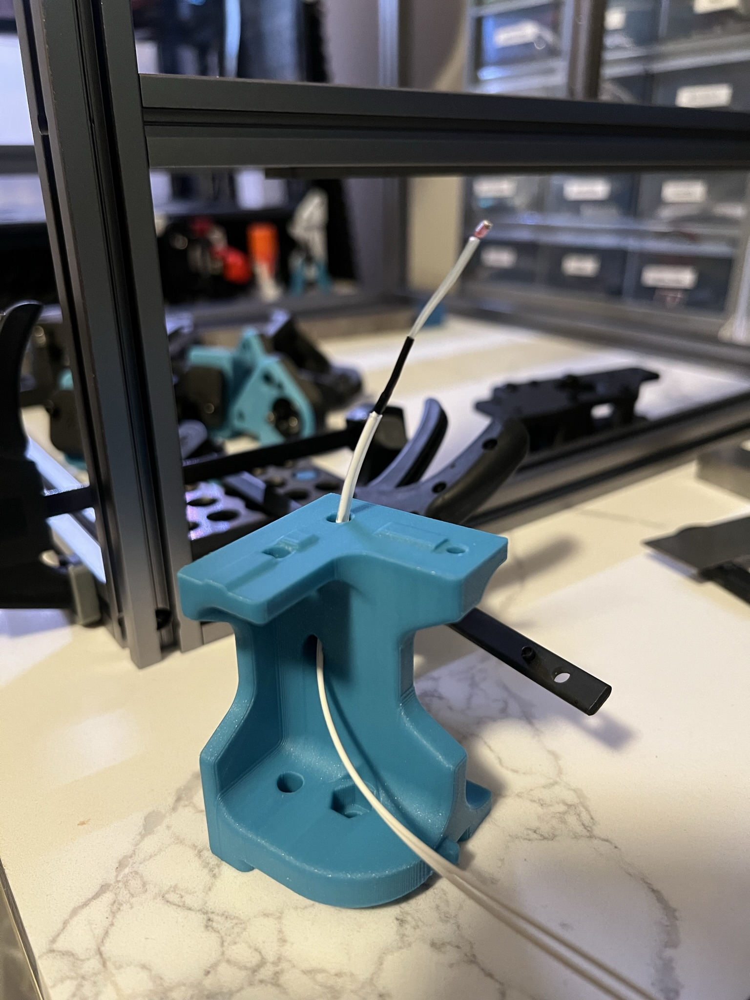

# Trident Thermistor Corner
 ### Mr. Thermistorfoot lets lets you cleanly run your thermistor from your electronics bat up through the center of your vertical extrusions for frame temp monitoring and thermal expansion compensation.  

### Printing
  * Default voron settings
  * No supports needed

### Instructions:
 
This is the A corner, so this will place your thermistor in the left-rear or front right.  

