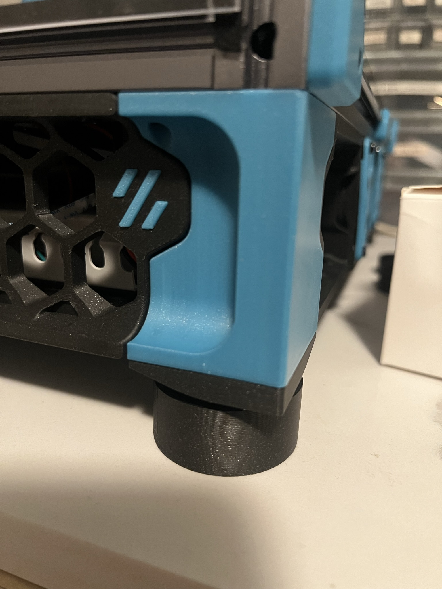

# Vibration Damping Feet
 ### Uses sorbothane rings to dampen printer vibration 

### BOM

Size | Qty
--- | ---
Isolate It: Sorbothane Vibration Isolation Washer 70 Duro (0.5" ID - 1.5" OD - 0.5" Thick)* | 4
Self adhesive cork or similar anti skid (optional) | 4

*tested with Voron Trident 300, smaller lighter printers will likely require a lower durometer

### Printing
  * Default voron settings
  * No supports needed

### Instructions:
 
Add anti-skid cork or similar to bottom of cup and trim.  Place the sorbothane ring in the cup, then install the cap as shown and install underneath your stock pinter feet.   

*tested with Voron Trident 300, smaller lighter printers will likely require a lower durometer
